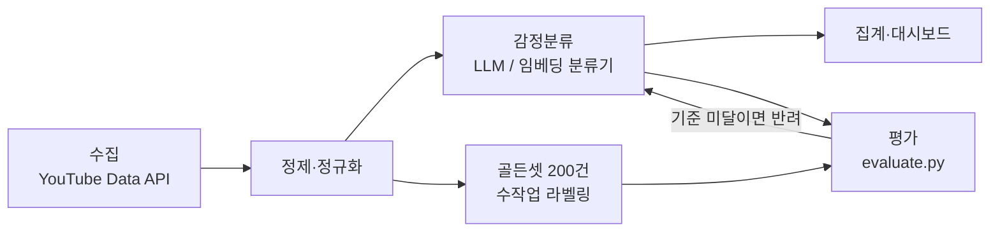

# YouTube 댓글 감정분석 — 수집부터 대시보드까지

> 팀 캡스톤에서 내가 맡았던 두 지점(**수집**과 **시각화**)을 지금 도구로 다시 만들면서,
> 그 사이에 **"이 답을 믿어도 되는가"를 재는 장치**를 끼워 넣는다.

## 왜 이걸 만드는가

2023년 캡스톤 「Slack을 이용한 데이터 리포팅」(4인 팀, 기업연계)에서 나는 파이프라인의 양 끝단을 맡았다 — 유튜브 댓글 수집(Selenium)과 Superset 대시보드. 가운데 감정분석은 **AWS Comprehend 호출**이었다.

그때 없었던 것이 하나 있다. **Comprehend가 내놓은 라벨이 맞는지 재는 장치.** 대시보드의 막대 높이가 맞는지 확인할 방법이 없는 채로 그래프를 그렸다.

이 저장소는 그 가운데를 LLM으로 바꾸고, **거기에 골든셋 평가를 붙인다.** 요지는 모델 성능이 아니다 —

> **측정할 수 없는 파이프라인은 대시보드까지 가도 신뢰할 수 없다.**

## 파이프라인



**골든셋은 분류기를 만들기 전에 먼저 고정한다.** 나중에 만들면 모델이 잘하는 쪽으로 기준이 휘기 때문이다.

## 핵심 설계 결정

### 1. 평가셋을 먼저, 분류기는 나중에

라벨링 예산의 일부를 **평가 전용으로 먼저 떼어둔다.** 골든셋은 한 번 학습·프롬프트 튜닝에 섞이면 되돌릴 수 없다. 순서를 바꾸면 이후의 모든 숫자가 자기 자신을 채점한 결과가 된다.

### 2. 3클래스 — 가운데에 '복합'을 둔다

긍정 / 부정 / **복합**. 판단이 갈리는 댓글을 억지로 한쪽에 넣으면 라벨 자체가 노이즈가 된다. '복합'은 **애매한 사례의 처리 규칙을 라벨 체계 안에 내장한 것**이다.

2023년 캡스톤이 쓴 Comprehend도 `POSITIVE / NEGATIVE / MIXED / NEUTRAL`을 내놓았는데, 여기서는 `NEUTRAL`을 두지 않는다 — 무평가 댓글은 **라벨이 아니라 수집 단계에서 걸러야** 한다는 판단이다. 기준은 [docs/labeling-guide.md](docs/labeling-guide.md)에 명문화했다.

## 현재 상태

| 구성요소 | 상태 |
|---|---|
| `src/evaluate.py` — 평가 하네스 | ✅ **동작.** 표준 라이브러리만 사용 |
| `docs/labeling-guide.md` — 라벨링 기준 | ✅ 판정 규칙 확정 |
| `src/collect_youtube.py` — 수집 | 🔲 뼈대 (YouTube Data API v3) |
| `src/baselines/` — 분류기 비교 | 🔲 뼈대 (zero-shot / 임베딩 분류기) |
| 골든셋 200건 | 🔲 미착수 — **이 저장소의 핵심 자산** |
| 대시보드 | 🔲 미착수 |

숫자를 미리 적어두지 않는다. **실제로 실행한 값만** `results/`에 기록한다.

## 재현하기

평가 하네스는 의존성 없이 바로 돈다.

```bash
python3 src/evaluate.py data/sample_comments.csv data/sample_predictions.csv
```

클래스별 Precision/Recall/F1, macro·weighted F1, 혼동 행렬을 출력한다. 동봉된 합성 샘플 24건 기준 macro F1 **0.833**이 나오면 정상이다.

## 데이터 정책

- 유튜브 댓글 **원문은 이 저장소에 포함하지 않는다** (저작권·플랫폼 약관). 실데이터는 `data/real/`(gitignore)에 로컬로만 둔다
- 공개하는 것은 **스키마 · 집계 통계 · 평가 결과**뿐이다
- `data/sample_*.csv`는 형식 시연용 **합성 데이터**이며 실제 댓글이 아니다

## 구조

```
├── data/                   # 합성 샘플 + 스키마 (원문 비공개)
├── docs/labeling-guide.md  # 3클래스 판정 규칙 ← 설계 판단이 적힌 곳
├── src/
│   ├── evaluate.py         # 골든셋 평가 하네스 (stdlib only) ✅
│   ├── collect_youtube.py  # 수집 (YouTube Data API)
│   └── baselines/          # 분류 방식 비교
└── results/                # 비교 결과 (실행 후 기록)
```

## 참고 — 이 순서를 처음 쓴 곳

평가셋을 먼저 고정하는 방식은 이전에 혼자 진행한 유튜브 댓글 감정분석 프로젝트에서 처음 썼다. GPT-3 파인튜닝에 n8n으로 수집–처리–산출을 자동화한 구성이었다.

도구는 전부 바뀌었지만 순서는 그대로다 — **재는 자를 먼저 만들고, 그 다음에 모델을 고른다.**
