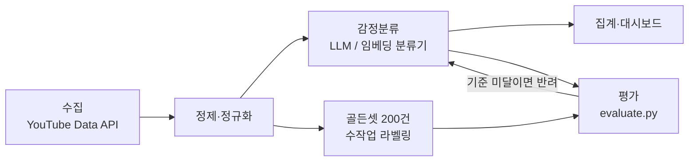

# YouTube 댓글 감정분석 — 수집부터 대시보드까지

> 분류기를 고르기 전에 재는 자부터 만든다. 이 저장소는 그 순서에 관한 것이다.

## 왜 이걸 만드는가

2023년 캡스톤 「Slack을 이용한 데이터 리포팅」에서 나는 파이프라인의 양 끝단을 맡았다. 유튜브 댓글을 긁어오는 쪽과, 그 결과를 Superset 대시보드로 보여주는 쪽이다. 가운데 감정분석은 AWS Comprehend 호출이었다.

그때 없던 것이 하나 있다. **Comprehend가 내놓은 라벨이 맞는지 재는 장치.**

대시보드는 잘 돌아갔다. 언어별로 막대가 서고 국가별로 수치가 나왔다. 그런데 그 막대 높이가 맞는지 확인할 방법이 없었다. 관리형 API가 준 답을 그대로 집계해서 그렸을 뿐이다. 틀렸다면 틀린 채로 그려졌을 것이고, 우리는 몰랐을 것이다.

이 저장소는 그 가운데를 LLM으로 바꾸고, **거기에 평가를 붙인다.** 요지는 모델 성능이 아니다.

> **측정할 수 없는 파이프라인은 대시보드까지 가도 신뢰할 수 없다.**

## 파이프라인



주목할 곳은 아래쪽 가지다. **골든셋은 분류기를 만들기 전에 먼저 갈라져 나온다.** 순서가 중요하다. 분류기를 먼저 만들고 나중에 평가셋을 뜨면, 기준이 모델이 잘하는 쪽으로 슬며시 휜다. 자기 답안을 보고 채점표를 만드는 셈이다.

## 두 가지 설계 결정

### 평가셋을 먼저, 분류기는 나중에

라벨링에 쓸 수 있는 시간은 유한하다. 그 예산의 일부를 **평가 전용으로 먼저 떼어둔다.**

골든셋은 한 번 학습이나 프롬프트 튜닝에 섞이면 되돌릴 수 없다. 이후에 나오는 모든 숫자가 자기 자신을 채점한 결과가 되고, 그건 숫자처럼 생겼을 뿐 숫자가 아니다. 그래서 이 결정은 미룰 수 있는 종류가 아니다 — 맨 처음에 하거나, 영영 못 한다.

### 클래스 가운데에 '복합'을 둔다

긍정과 부정만으로는 "노래는 좋은데 무대는 아쉽다"를 담을 수 없다. 억지로 한쪽에 넣으면 라벨이 노이즈가 된다.

한편 `NEUTRAL`은 두지 않았다. 관리형 서비스들은 대개 주지만, "1등" 같은 댓글은 감정이 중립인 게 아니라 **평가 자체가 없는 것**이고, 그걸 라벨로 흡수하면 분류기가 애매한 것을 전부 거기 밀어 넣어도 점수가 유지된다. 무평가 댓글은 수집 단계에서 걸러낸다.

판정 규칙은 [docs/labeling-guide.md](docs/labeling-guide.md)에 다섯 개로 정리해 두었다.

## 지금 어디까지 됐나

돌아가는 것은 평가 하네스다. 의존성 없이 바로 실행된다.

```bash
python3 src/evaluate.py data/sample_comments.csv data/sample_predictions.csv
```

클래스별 Precision/Recall/F1과 macro·weighted F1, 혼동 행렬을 출력한다. 동봉된 합성 샘플 24건 기준으로 macro F1 **0.833**이 나오면 정상이다.

나머지는 이렇다.

| 구성요소 | 상태 |
| --- | --- |
| `src/evaluate.py` — 평가 하네스 | 동작 |
| `docs/labeling-guide.md` — 판정 규칙 | 확정 |
| `src/collect_youtube.py` — 수집 | 뼈대 |
| `src/baselines/` — 분류기 비교 | 뼈대 |
| **골든셋 200건** | **미착수. 다음 할 일이자 이 저장소의 핵심 자산** |
| 대시보드 | 미착수 |

`results/`의 비교 표는 비어 있다. **실제로 실행한 값만 채운다.** 추정치를 미리 적어두면 그때부터 그 표는 기록이 아니라 계획이 된다.

## 데이터 정책

유튜브 댓글 원문은 이 저장소에 넣지 않는다. 저작권과 플랫폼 약관 때문이다. 실데이터는 `data/real/`에 두고 이 경로는 `.gitignore`에 있다. 공개하는 것은 스키마와 집계 통계, 평가 결과뿐이다.

`data/sample_*.csv`는 형식을 보여주기 위한 합성 데이터이며 실제 댓글이 아니다.

## 구조

```
├── data/                   합성 샘플 + 스키마 (원문 비공개)
├── docs/labeling-guide.md  판정 규칙 — 설계 판단이 적힌 곳
├── src/
│   ├── evaluate.py         골든셋 평가 하네스 (표준 라이브러리만)
│   ├── collect_youtube.py  수집 (YouTube Data API)
│   └── baselines/          분류 방식 비교
└── results/                비교 결과 (실행 후 기록)
```

## 이 순서를 처음 쓴 곳

평가셋을 먼저 고정하는 방식은 이전에 혼자 진행한 유튜브 댓글 감정분석 프로젝트에서 처음 썼다. GPT-3 파인튜닝에 n8n으로 수집부터 산출까지 자동화한 구성이었다.

도구는 전부 바뀌었다. 순서만 그대로다 — **재는 자를 먼저 만들고, 그 다음에 모델을 고른다.**
